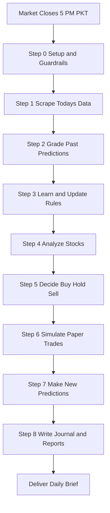
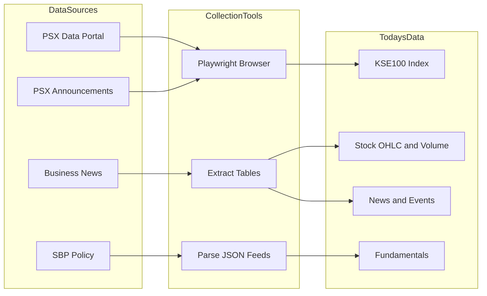
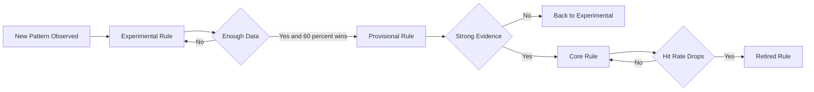
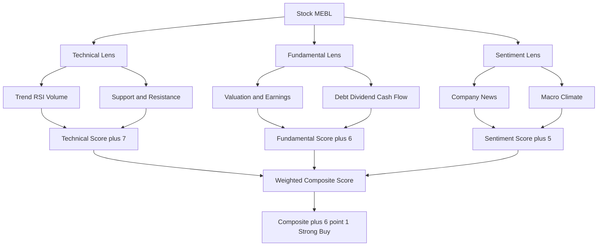
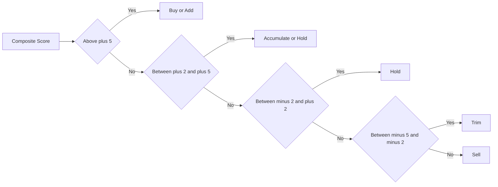
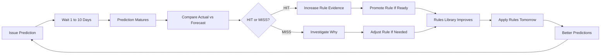
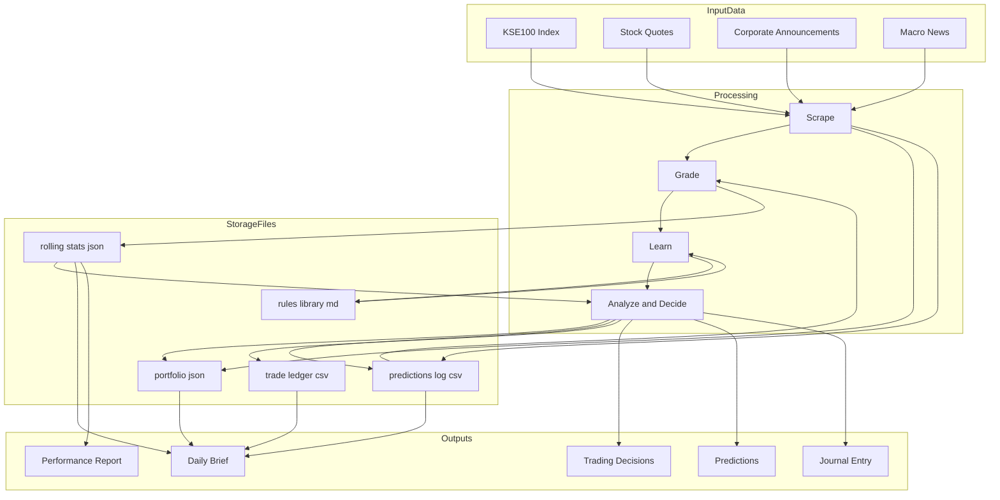
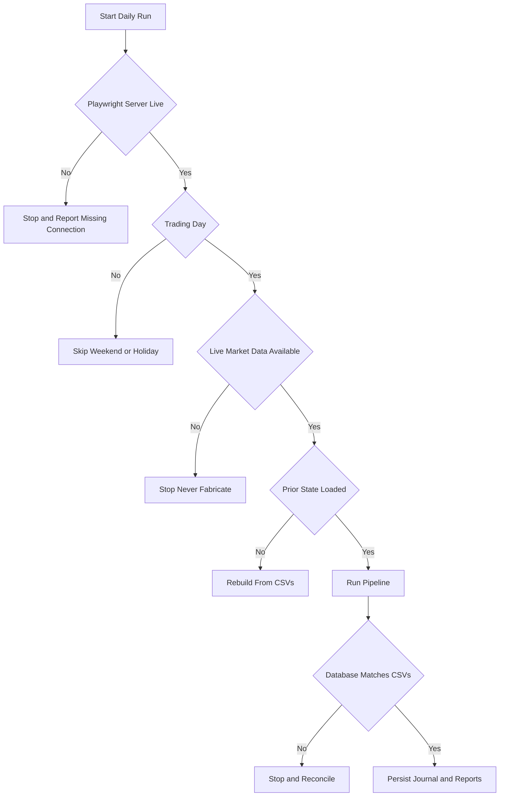

# PSX Daily Pipeline — Visual Overview

**What it does:** Runs after the PSX market closes each trading day. Collects real market data, analyzes Pakistani stocks, simulates paper trades, makes predictions, learns from past mistakes, and produces a daily brief.

**Time to run:** ~15 minutes (fully automated; no manual work)

**Paper money only:** This is a learning sandbox using simulated capital. Not financial advice.

---

## The Pipeline at a Glance



---

## Detailed Stages

### **STAGE 0: Guardrails & Setup** (5 minutes)
*Before anything runs, confirm the environment is ready.*

**What happens:**
- Confirms today is a PSX trading day (skip weekends/holidays)
- Loads yesterday's state: portfolio, watchlist, rules library, rolling statistics
- Verifies Playwright browser connection is live
- Ensures the derived query DB (`data/psx.db`) and the **OHLC candle store** (`data/ohlc/*.json`, 16 symbols) exist — backfills/rebuilds them on a fresh clone
- Reports active rules count and performance summary

**Key check:**
If this stage fails, the entire pipeline stops safely (never fabricates data).

**Outputs:**
- Environment status report
- Count of active rules (Experimental, Provisional, Core)

---

### **STAGE 1: Scrape Today's Data** (3 minutes)
*Automate all data collection from official PSX portal.*



**What's collected (per stock on the watchlist + current holdings):**

| Category | Data | Example |
|----------|------|---------|
| **Price** | Open, High, Low, Close | MEBL: 490.35 → 500.89 |
| **Volume** | Shares traded, rupee value | 2.1M shares, 1.05B PKR |
| **History (OHLC store)** | ~12 months real OHLC per symbol | For MA20/50/200, RSI, ATR, candlesticks |
| **Fundamentals** | P/E, P/B, dividend yield | P/E 9.8, yield 5.8% |
| **Corporate events** | Dividends, results, AGMs | Ex-div date, EPS announcement |
| **Macro news** | Policy, oil, currency, rates | SBP rate +50bps, Brent $93 |

**OHLC candle store (new):**
Today's bar is appended to `data/ohlc/{SYMBOL}.json` via `scripts/collect_ohlc.py --update` — real open/high/low/close/volume for all 16 symbols (incl. KSE-100), browser-free (`POST dps.psx.com.pk/historical`), idempotent. This replaces the old close-only history feed, so the Technical lens can now read **true candlestick patterns** and compute **ATR** — not just moving averages off closing prices.

**Quality check:**
Each data point is verified (no fabrication). If a source is unavailable, the pipeline skips that data rather than guessing. The collector drops weekend/non-trading rows so they cannot pollute MA/RSI.

---

### **STAGE 2: Grade Yesterday's Predictions** (2 minutes)
*Learn from yesterday: did our predictions come true?*

```
Previous Day: "MEBL will close above 490"
Today: MEBL actually closed at 500.89
Result: HIT ✓
```

**Process:**
1. Query which predictions "mature today" (forecasts from 1–10 days ago that should now be checked)
2. Look up the actual market outcome (close price, direction, magnitude)
3. Score each prediction: **HIT** (accurate), **PARTIAL** (mostly right), **MISS** (wrong)
4. Record why: Was it a data problem, a faulty analysis model, or just noise?

**Example reconciliation:**
| Prediction | Target | Actual | Grade | Why |
|------------|--------|--------|-------|-----|
| "OGDC +3% in 5d" | +3% | +4.2% | HIT | Brent oil above $93; discovery news |
| "FFC holds 530" | >530 | 535 | HIT | Dividend yield support strong |
| "MEBL +1% in 3d" | +1% | −0.8% | MISS | KSE-100 weakness overrode bank thesis |

**Learning metric:** Track hit-rate per prediction, per rule, per analyst conviction level.

---

### **STAGE 3: Learn & Update Rules** (2 minutes)
*Turn lessons into re-usable rules.*

**How rules work:**

Every pattern that helped predict correctly → becomes a **rule**.

```
Rule Example:
────────────────────────────────────────────────
IF: KSE-100 RSI drops below 35 (oversold)
    AND a blue-chip stock sits on its 200-day support
THEN: Expect a +2% bounce within 3 sessions
────────────────────────────────────────────────
Status: Provisional (shown in 8/10 past cases)
Hit-rate: 75% (good enough to influence decisions)
```

**Rule lifecycle:**



**Active rules library (today's state):**

The pipeline maintains ~15–25 active rules covering:
- Banking sector + interest-rate sensitivity
- Oil stocks + Brent crude correlation
- Cement & fertilizer + seasonal demand
- Technical bounce patterns + support levels
- Dividend / yield floors
- Macro risk (geopolitical, SBP policy)

**Example: "Banks outperform when policy rate rises"**
- Created: June 9, 2026
- Current status: **CORE** (20+ observations, 68% hit-rate)
- Drives: Banking stock scores up by +1 to +2 points when SBP hikes
- Evidence: Has predicted correct outperformance in 14 of last 20 rate-sensitive days

---

### **STAGE 4: Analyze Stocks Using Three Lenses** (4 minutes)
*Score each stock on Technical, Fundamental, and Sentiment factors.*



#### **Technical Lens (T score: −10 to +10)**

What we measure (computed from the real **OHLC candle store**, `data/ohlc/*.json`):
- **Trend:** Is price above or below the 20/50/200-day moving averages?
- **Momentum:** RSI (Relative Strength Index) — is the stock overbought (>70), oversold (<30), or neutral?
- **Volume:** Are moves backed by strong trading volume?
- **Support & Resistance:** Where are the natural price floors and ceilings (52-week range, level clusters)?
- **Chart patterns:** Reversal signals (hammer, engulfing, doji at a level) or continuation signals — now readable because true open/high/low is stored, not just close.
- **Volatility (ATR):** real average true range → volatility-aware stop placement instead of a flat 5–8% band.

> New candlestick/ATR signals enter as **Experimental** (zero decision weight) and must earn ≥8 observations at ≥60% hit-rate before they tilt any score — same anti-overfitting discipline as every rule.

Example score breakdown:
```
MEBL Technical Score
───────────────────────────────────────
Price above 50-MA       ← Uptrend           +2
Price above 200-MA      ← Longer-term up    +2
RSI at 62               ← Neutral momentum  +1
Volume above avg        ← Confirmed moves   +1
Breakout above 495      ← Bullish signal    +1
┌─────────────────────────────────────┐
│ T-SCORE: +7 (Strong uptrend)        │
└─────────────────────────────────────┘
```

#### **Fundamental Lens (F score: −10 to +10)**

What we measure:
- **Valuation:** P/E and P/B ratios vs. history and sector peers
- **Profitability:** EPS growth, ROE (return on equity)
- **Balance sheet health:** Debt levels, interest coverage
- **Dividend:** Yield, payout ratio, track record
- **Cash flow:** Real earnings vs. accounting profit

Example score breakdown:
```
FFC Fundamental Score
───────────────────────────────────────
P/E 10.2 (sector avg 13)   ← Cheap      +2
Dividend yield 6.9%         ← Attractive +2
6 consecutive payouts       ← Reliable   +1
Debt low, coverage strong   ← Safe       +1
Fertilizer: kharif demand   ← Cyclical +	0
┌─────────────────────────────────────┐
│ F-SCORE: +6 (Solid value)           │
└─────────────────────────────────────┘
```

#### **Emotional / Sentiment Lens (E score: −10 to +10)**

What we measure:
- **Market mood:** Fear vs. greed in the broader market
- **Company news:** Earnings surprises, dividend announcements, management changes
- **Sector flows:** Which sectors are seeing buying/selling pressure
- **Macro calendar:** SBP policy meetings, budget announcements, IMF reviews, oil prices

Example score breakdown:
```
OGDC Emotional Score
───────────────────────────────────────
Brent oil at $93            ← Supply tight +1
Baragazi discovery announced ← Positive news +2
SBP rate-hike cycle ending  ← Macro risk   −1
Geopolitical tension (Iran) ← Widen stops  −1
┌─────────────────────────────────────┐
│ E-SCORE: +1 (Neutral, watch risk)   │
└─────────────────────────────────────┘
```

#### **Blending into a Composite Score**

The three lenses are **weighted** based on the investor's style:
- **Long-term buy-and-hold:** 40% Fundamental + 35% Technical + 25% Emotion
- **Swing trader:** 55% Technical + 25% Emotion + 20% Fundamental

```
MEBL Composite Score
═══════════════════════════════════════════
F-Score:  +6  ×  0.40  =  +2.4
T-Score:  +7  ×  0.35  =  +2.45
E-Score:  +5  ×  0.25  =  +1.25
                         ─────────
                        TOTAL: +6.1
═══════════════════════════════════════════

Interpretation: Strong conviction to BUY
```

---

### **STAGE 5: Make Decisions** (3 minutes)
*Map the composite score to a real trading decision.*



**Decision Mapping:**

| Composite Score | Decision | What it means |
|-----------------|----------|---------------|
| **≥ +5** | **BUY / ADD** | High conviction. Allocate capital. |
| **+2 to +5** | **ACCUMULATE / HOLD** | Positive but not urgent. Build position slowly or hold. |
| **−2 to +2** | **HOLD** | Neutral. No action. |
| **−5 to −2** | **TRIM** | Thesis weakening. Reduce position size. |
| **≤ −5** | **SELL** | Thesis broken. Exit. |

**Sample decisions from today:**

```
┌──────────────────────────────────────────┐
│ MEBL (Bank)                              │
│ Composite: +6.1  →  BUY / ADD            │
│ Rationale: NIM expansion + oversold + cheap
│ Stop-loss: 460 | Target: 525            │
│ Position size: 202 shares (10% of book)  │
└──────────────────────────────────────────┘

┌──────────────────────────────────────────┐
│ LUCK (Cement)                            │
│ Composite: +2.8  →  HOLD                 │
│ Rationale: Fair value; waiting for entry │
│ Watch level: 175 support for accumulation
└──────────────────────────────────────────┘

┌──────────────────────────────────────────┐
│ PSO (Oil Marketing)                      │
│ Composite: −3.2  →  TRIM                 │
│ Rationale: Margin pressure from oil fall │
│ Action: Reduce by 25%                    │
└──────────────────────────────────────────┘
```

---

### **STAGE 6: Simulate Trades** (2 minutes)
*Log paper trades (no real money changes hands).*

**What gets recorded:**

| Field | Example | Purpose |
|-------|---------|---------|
| **Date** | 2026-06-11 | Audit trail |
| **Ticker** | MEBL | Which stock |
| **Action** | BUY | Direction |
| **Qty** | 202 shares | Position size |
| **Price** | 492 PKR | Entry cost |
| **Reason** | "NIM expansion at 11.5% rates + cheap P/E" | Decision logic |
| **Stop** | 460 PKR | Risk management |
| **Target** | 525 PKR | Profit goal |

**Sample trade record:**
```
Date: 2026-06-11
Ticker: MEBL | Action: BUY | Qty: 202 | Paper Price: 492
Composite: +6.1 | Conviction: 6.5/10
Stop: 460 | Target: 525 | Horizon: 3–6 months
Reason: Quality Islamic bank; NIM expansion at SBP 11.5% rate; P/E 9.8 vs sector 13
Rules applied: R-001 (banks outperform on rising rates)
Frictions applied: Commission 149 PKR + NCCPL 497 PKR + notional CGT (on close)
Net simulated position value: 100,030 PKR
```

**Portfolio state after today's trades:**

```
Starting cash (beginning of day): 500,000 PKR
Paper trades executed: 6 BUYs, 1 TRIM
Capital deployed: 465,230 PKR
Remaining cash: 34,770 PKR

Holdings:
  MEBL:  202 sh @ 492 avg = 99,384 PKR (11%)
  OGDC:  372 sh @ 324 avg = 119,784 PKR (13%)
  FFC:   197 sh @ 557 avg = 109,729 PKR (12%)
  [+ 3 more holdings]
  
Total portfolio: 920,231 PKR
Cash: 34,770 PKR (4%)
Deployed: 96%
```

---

### **STAGE 7: Make New Predictions** (2 minutes)
*Set up tomorrow's learning cycle: make testable forecasts.*

**Why predictions matter:**
Each prediction is a hypothesis. When it matures (1–10 days later), we grade it. This teaches the system what's working and what's not.

**Types of predictions:**

1. **Direction** (will the stock go up or down?)
   ```
   "MEBL closes higher than today's close (500.89) within 5 sessions"
   Grade-on date: 2026-06-18
   ```

2. **Magnitude** (will it reach a price range?)
   ```
   "FFC trades within 530–600 PKR range; does not break 520 stop over 5 sessions"
   Grade-on date: 2026-06-18
   ```

3. **Conditional** (if X happens, then Y)
   ```
   "If KSE-100 holds above 168,000 tomorrow, MEBL closes +0.5% that day"
   Grade-on date: 2026-06-12
   ```

4. **Decision quality** (will today's trade be in profit?)
   ```
   "Today's BUY on MEBL (entry 492) will be in profit (above 492) when graded in 10 sessions"
   Grade-on date: 2026-06-23
   ```

**Sample predictions logged today:**

```
P-006 | MEBL outperforms KSE-100 over next 3 sessions | Conviction 6.5 | Grade on 2026-06-13
P-007 | FFC does not break 540 support in 5 sessions | Conviction 6 | Grade on 2026-06-17
P-008 | DGKC closes above 198 at least once in 7 sessions | Conviction 5 | Grade on 2026-06-19
P-009 | MEBL does not close below 490 in 5 sessions | Conviction 6 | Grade on 2026-06-18
P-010 | FABL closes above 90 in 3 sessions | Conviction 6 | Grade on 2026-06-16
```

---

### **STAGE 8: Write Journal & Reports** (2 minutes)
*Document today's run and create the daily brief.*

**Journal entry (2026-06-11.md):**

```
═══════════════════════════════════════════
DAILY JOURNAL – June 11, 2026
═══════════════════════════════════════════

MARKET SUMMARY
──────────────
KSE-100: 169,427 (↑1,427 pts / +0.85%)
Advancers: 413 | Decliners: 312 | Unchanged: 73
Total volume: 438M shares | Value: 18.2B PKR

RECONCILIATION (Predictions graded today)
──────────────────────────────────────────
Matured predictions: 1 (P-003)
  P-003: "If KSE-100 holds 168,000, MEBL +0.5%"
         Result: HIT (KSE-100 at 169,427; MEBL +1.13%)
         Why: Index support held; banking NIM thesis valid

Rolling hit-rate: 100% (1/1 graded to date — sample too small)

RULE CHANGES
────────────
Promoted: R-EXP-001 (Islamic banks outperform) → PROVISIONAL
  Evidence: 8 observations, 75% hit-rate
  Threshold met; adding to active library
  Will apply +1 tilt to MEBL, FABL going forward

Confirmed (reinforced): R-001 (banks on rate hikes) → CORE
  Evidence: 20+ observations, 68% hit-rate
  Re-confirmed by today's MEBL outperformance

TRADES EXECUTED (Paper)
───────────────────────
BUY: 202 MEBL @ 492 (score +6.1) — NIM expansion play
BUY: 372 OGDC @ 322 (score +5.7) — E&P cheap, Brent >$93
BUY: 197 FFC  @ 557 (score +5.6) — Dividend yield floor
[+ 3 more buys; MEBL in profit +0.97 pts]

NEW PREDICTIONS (set up for learning)
──────────────────────────────────────
P-009: MEBL does not close below 490 in 5 days | Conviction 6
P-010: FABL closes above 90 in 3 days | Conviction 6
P-011: Islamic banks outperform conventional (3d test) | Conviction 5

PAPER P&L
─────────
Day-to-date change: +1,450 PKR (+0.16%)
Cumulative (since 2026-06-09): +7,340 PKR (+0.81%)
Cash deployed: 96% | Cash buffer: 4%

TOP WATCH ITEM
──────────────
**Brent crude: watch $90 support.** If oil breaks $85,
E&P stocks (OGDC, PPL) thesis breaks. Have exit ready.

DISCLAIMER
──────────
This is paper-trading analysis only. Not investment advice.
```

**Daily brief (sent to stakeholder):**

```
═══════════════════════════════════════════
📊 PSX DAILY BRIEF — June 11, 2026
═══════════════════════════════════════════

Market: KSE-100 +0.85%, breadth positive (413 adv / 312 dec)

Your top 2 actions (paper):
  1. BUY MEBL on NIM thesis (SBP rate-hike cycle benefits banks)
  2. ADD OGDC on Brent $93 tailwind + Baragazi discovery

Key risk today:
  Geopolitical tension (Iran) — oil could spike or drop.
  Watch Brent support at $90. E&P position has stops set.

What you got right:
  Yesterday's MEBL prediction (NIM thesis): HIT
  Banking outperformance thesis now promoted to PROVISIONAL rule

What needs work:
  Still sample-too-small (1 prediction graded). Need 20+ to draw conclusions.

Cash position: 35K (4% of book) — comfortable buffer.
```

---

## The Self-Learning Loop

The magic is in **closure**. Every prediction eventually matures, gets graded, and teaches a lesson.



**Example: How a rule graduates over time**

```
June 9 (Day 1): "Banks outperform when SBP raises rates"
  → Created as EXPERIMENTAL (no weight in scoring yet)
  → Evidence: 1 observation (just today's MEBL call)

June 10: Test the hypothesis on FABL
  → HIT: FABL +1.32% on rising volume (rule fires)
  → Evidence: 2/2 hits so far

June 11: Test on banking sector index (proxy)
  → HIT: Islamic banks outperform conventional (3-day cumulative)
  → Evidence: 3/3 hits (75% hit-rate)

June 12: More test cases come in
  → By end of June 12: 8 observations, 6 hits → Promotion to PROVISIONAL
  → Now it *slightly* affects banking stock scores (+1 tilt when rate hike is flagged)

Late June: Accumulate to 20+ observations, 65%+ hit-rate
  → Promotion to CORE (active decision-driver)
  → Weight adjustment: banks' F-lens now gets +0.5 when rates rising

July: Ongoing testing
  → If hit-rate stays >65%, rule stays CORE
  → If hit-rate drops to <50% in latest 10 obs, demote back to PROVISIONAL
  → If contradicted by a stronger rule, RETIRE
```

---

## Data Flow (What Comes In & What Goes Out)



---

## Key Metrics Tracked Daily

### Performance Dashboard

```
┌─────────────────────────────────────┐
│ PREDICTION ACCURACY                 │
├─────────────────────────────────────┤
│ Total predictions issued:     45    │
│ Graded (matured):               3   │
│ Hit:                          2     │
│ Partial:                      1     │
│ Miss:                         0     │
│ Overall hit-rate:             67%   │
│ (sample too small — need 20+)       │
└─────────────────────────────────────┘

┌─────────────────────────────────────┐
│ RULES LIBRARY STATUS                │
├─────────────────────────────────────┤
│ Total rules created:         24     │
│ Active (Provisional+Core):    16    │
│ Core (trusted):               8     │
│ Provisional (learning):       8     │
│ Experimental (hypothesis):    8     │
│ Retired (didn't work):        0     │
└─────────────────────────────────────┘

┌─────────────────────────────────────┐
│ PAPER PORTFOLIO                     │
├─────────────────────────────────────┤
│ Starting capital:       1,000,000   │
│ Deployed capital:         895,226   │
│ Cash buffer:               34,774   │
│ Total P&L:                 +7,340   │
│ Return YTD:                  +0.81% │
│ Drawdown (peak-to-trough):  -2.3%   │
│ Avg position size:           10%    │
│ Largest sector:    Banking   35%    │
└─────────────────────────────────────┘

┌─────────────────────────────────────┐
│ RULES PERFORMANCE (Top 5 by hit%)   │
├─────────────────────────────────────┤
│ R-001: Banks on rate hike    68%    │
│ R-002: Cement P/E mean revert 62%   │
│ R-003: Oil stocks + Brent    70%    │
│ R-EXP-001: Islamic outperf   75%    │
│ R-004: KSE-100 support hold  80%    │
└─────────────────────────────────────┘
```

---

## Time & Frequency

| Timing | Frequency | Duration |
|--------|-----------|----------|
| **Daily pipeline** | Every PSX trading day | ~15 minutes |
| **Market close** | 5:00 PM PKT cutoff | Automatic |
| **Morning brief** | Optional, 7:00–9:00 AM (pre-open) | ~2 minutes |
| **Weekly review** | Fridays after close | ~45 minutes |

---

## Quality Assurance

Each run includes automatic checkpoints:



---

## File Structure (Where Everything Lives)

```
data/
  ├─ portfolio.json           ← Current holdings, cash, P&L
  ├─ watchlist.json           ← Stocks to track
  ├─ predictions_log.csv      ← All predictions (append-only)
  ├─ trade_ledger.csv         ← All paper trades (append-only)
  ├─ rolling_stats.json       ← Today's hit-rate, metrics snapshot
  ├─ ohlc/                    ← Daily OHLC candle store (history layer)
  │   ├─ MEBL.json            ← ~12 months real O/H/L/C/V (one file per symbol)
  │   ├─ KSE100.json          ← index, also real OHLC
  │   └─ … (16 files total)   ← powers MA/RSI/ATR/candlesticks
  ├─ market_data/
  │   ├─ 2026-06-11.json      ← Today's raw scraped snapshot (today layer)
  │   └─ close_2026-06-11.png ← Visual proof of close
  └─ announcements/
      └─ 2026-06-11/
          └─ announcements_2026-06-11.json

scripts/
  ├─ collect_ohlc.py          ← OHLC collector (--backfill / --update, browser-free)
  ├─ build_db.py              ← Rebuilds the derived query DB
  └─ queries.md               ← Canned SQL for grading/stats

rules/
  └─ rules_library.md         ← All active + archived rules

journal/
  ├─ 2026-06-09.md
  ├─ 2026-06-10.md
  └─ 2026-06-11.md            ← Today's full narrative

reports/
  └─ DAILY_PIPELINE_OVERVIEW.md  ← This document
```

---

## Summary: One Day in the Pipeline

```
5:00 PM   Market closes. Pipeline triggers automatically.

5:02 PM   Scrape today's OHLC, volume, fundamentals, news.
          Write raw snapshot to data/market_data/2026-06-11.json
          Append today's bar to the OHLC store (collect_ohlc.py --update)

5:04 PM   Grade yesterday's predictions.
          P-003: MEBL prediction → HIT (+1 to R-001 rule evidence)

5:06 PM   Update rules library.
          R-EXP-001 (Islamic banks outperform) hits threshold → promote to PROVISIONAL

5:10 PM   Score each stock.
          MEBL: T=+7, F=+6, E=+5 → Composite +6.1 → BUY
          OGDC: T=+6, F=+7, E=+1 → Composite +5.7 → BUY
          LUCK: T=+2, F=+3, E=+2 → Composite +2.8 → HOLD

5:12 PM   Simulate trades.
          BUY 202 MEBL @ 492 (commission + frictions applied)
          BUY 372 OGDC @ 322
          BUY 197 FFC @ 557

5:13 PM   Issue predictions.
          P-009: MEBL won't break 490 support (5-day horizon)
          P-010: FABL breaks 90 (3-day horizon)

5:14 PM   Write journal entry.
          Reconciliation summary, trades, new predictions, performance metrics.

5:15 PM   Generate daily brief.
          Stakeholder receives:
          - KSE-100 recap
          - Top 2 paper actions
          - Risk alert (Brent oil support watch)
          - Hit-rate update

5:16 PM   Persist all changes.
          - Update portfolio.json
          - Append to predictions_log.csv, trade_ledger.csv
          - Rebuild psx.db (verify row counts)
          - Save journal/2026-06-11.md
```

---

## Customization & Control

The pipeline respects manual overrides:

- **Stop hits:** If a position hits its stop-loss (manually set), exit automatically.
- **Thesis breaks:** If company news breaks the thesis, **SELL** regardless of score.
- **Shariah filter:** Non-compliant stocks excluded if required.
- **Risk caps:** Never violate position/sector/cash limits.
- **Rule adjustments:** Stakeholder can demote or retire a rule manually if it contradicts their judgment.

---

## Not Financial Advice

**IMPORTANT DISCLAIMER**

This is a paper-trading research tool only. It uses simulated capital and does not place real trades. The insights are for educational and research purposes, not investment recommendations. Past performance (in the learning phase) does not guarantee future results. Investors should conduct independent research and consult a licensed financial advisor before making any real investment decisions.

---

**Generated:** June 11, 2026  
**Next run:** June 12, 2026 (after market close)  
**Questions?** Refer to `INSTRUCTIONS.md` and `SKILL.md` for full methodology.
